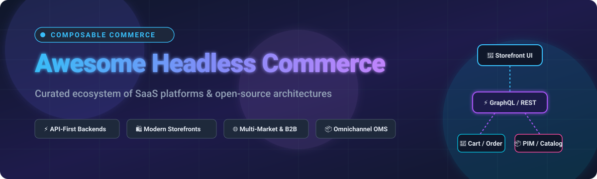

# ⚡ Awesome Headless Commerce 

  

# 🛒 Awesome Headless & Composable Commerce Ecosystem
**A Curated Directory of API-First SaaS Platforms, High-Performance Open-Source Backends, Headless Storefronts & Modular Commerce Tools**

*Last updated: August 2026*

---

## 📖 Overview & Ecosystem Guide

Welcome to the definitive, SEO-optimized directory of **Headless Commerce**, **Composable Commerce**, and **API-First Shopping Systems**. Headless commerce completely decouples the ecommerce frontend presentation layer (web apps, mobile apps, IoT, POS, VR/AR storefronts) from core commerce services (product catalogs, pricing matrices, inventory, checkout, order orchestration, promotions, customer data).

Whether you are building blazing-fast Jamstack storefronts with Next.js/Remix/SvelteKit or scaling enterprise multi-region B2B & D2C architectures, this collection indexes the most reliable **SaaS platforms** and production-tested **open-source frameworks**.

---

## 📑 Table of Contents
- [📊 Market Landscape & Industry Dynamics](#-market-landscape--industry-dynamics)
- [☁️ SaaS & Hosted Composable Platforms](#️-saas--hosted-composable-platforms)
- [💻 Open-Source GitHub Projects](#-open-source-github-projects)
- [🛠️ Architecture Starters & Frameworks](#️-architecture-starters--frameworks)
- [📈 Star History](#-star-history)
- [🤝 How to Contribute](#-how-to-contribute)
- [📄 Disclaimer](#-disclaimer)

---

## 📊 Market Landscape & Industry Dynamics

> 💡 **Market Size & Structure**: The global headless commerce market is estimated at **$2.13 Billion in 2026** (projected to reach **$7.24 Billion by 2033 at a 22.6% CAGR**), operating as a **moderately fragmented, best-of-breed composable ecosystem** rather than a winner-take-all monopoly, where specialized API-first microservices (MACH architecture: Microservices, API-first, Cloud-native, Headless) interconnect across checkout, search, CMS, and order management.

---

## ☁️ SaaS & Hosted Composable Platforms

*Platforms are sorted in descending order by enterprise market size, company valuation, and annual revenue.*

| Product | Company Scale (Valuation / Revenue) | Description | Pricing | Free Tier Limits |
| :--- | :--- | :--- | :--- | :--- |
| **[Adobe Commerce (Magento)](https://business.adobe.com/products/magento/magento-commerce.html)** | **~$130B+ Market Cap** (~$27B+ Annual Revenue) | Enterprise digital commerce suite with headless GraphQL APIs, omnichannel capabilities, and B2B workflows. | Starts at ~$22,000/year (Adobe Commerce cloud/license); Magento Open Source is $0 (Free) | Free forever for self-hosted Magento Open Source; no self-serve cloud trial (enterprise demo upon request) |
| **[BigCommerce](https://www.bigcommerce.com/)** | **~$440M Market Cap** (~$340M Annual Revenue) | Open SaaS commerce platform featuring high-throughput headless GraphQL/REST APIs, multi-storefront management, and B2B Edition. | Starts at $39/month (Standard; $105/mo for Plus, $399/mo for Pro) | 15-day free trial with full platform & API access; no credit card required |
| **[VTEX](https://vtex.com/)** | **~$610M Market Cap** (~$250M Annual Revenue) | Enterprise composable commerce platform with native marketplace, distributed order management, and headless storefront engines. | Starts at ~$500/month minimum platform fee + 0.5%–3% GMV revenue share | No free tier or self-serve trial; developer sandbox and API access provisioned via partner/sales program |
| **[commercetools](https://commercetools.com/)** | **~$1.9B Valuation** (~$175M Annual Revenue) | Pioneer of MACH composable commerce — cloud-native, multi-tenant API-first platform built for complex enterprise B2B & multi-brand retail. | Starts at ~$40,000 – $100,000/year (Core Commerce Edition quote-based) | 60-day free trial with full API & Merchant Center access; no credit card required |
| **[Fabric](https://fabric.inc/)** | **~$1.5B Valuation** (~$120M Annual Revenue) | Modular headless commerce suite offering standalone microservices (PIM, Cart/Checkout, OMS, Subscriptions) for high-growth digital brands. | Starts at ~$3,000 – $6,000/month (Modular enterprise plans) | No free tier or self-serve trial; proof-of-concept access provided via enterprise sales demo |
| **[Shopware](https://www.shopware.com/)** | **~$80M+ Annual Revenue** (Bootstrapped / Carlyle-backed) | Leading European commerce platform with robust headless API roots, AI copilot workflows, and spatial commerce capabilities. | Starts at €600/month (Rise plan; €2,400/mo for Evolve); Community Edition is €0 (Free) | Free forever for Community Edition (up to €1M GMV/year fair usage limit); free live cloud demo |
| **[Elastic Path](https://www.elasticpath.com/)** | **~$40M Annual Revenue** ($120M+ Total Funding) | Enterprise composable commerce platform specializing in multi-tenant product family catalogs, dynamic pricing, and unconstrained API workflows. | Starts at ~$50,000/year (Order & GMV-based tiers) | 14-day free trial with sandbox access for API testing; no credit card required |
| **[Commerce Layer](https://commercelayer.io/)** | **~$22M Total Funding** (~$4.5M Annual Revenue) | API-first transactional commerce engine purpose-built for global multi-currency, multi-language headless storefronts and Jamstack sites. | Starts at $0/month (Developer plan); paid growth plans scale by monthly orders | Free forever Developer plan (100 free orders/month + unlimited free test mode); no credit card needed |
| **[Saleor Cloud](https://saleor.io/)** | **~$10.5M Total Funding** (~$4.6M Annual Revenue) | Managed cloud infrastructure for Saleor's GraphQL-first composable commerce API with global multi-channel and localized catalogs. | Starts at $1,599/month (Select plan for up to $200k monthly GMV) | Free forever Sandbox environment (development/prototyping only; rate-limited at 120 req/min) |
| **[Medusa Cloud](https://medusajs.com/)** | **~$9M Total Funding** (Dawn / LocalGlobe backed) | Managed hosting and platform infrastructure designed for the modular Node.js/TypeScript Medusa commerce engine. | Starts at $29/month (Develop plan); Medusa core is $0 (Free open-source) | Free forever open-source core (self-hosted); cloud tiers start with paid develop tier |
| **[Scayle](https://www.scayle.com/)** | **Enterprise B2B Division** (ABOUT YOU Group) | High-performance enterprise retail engine powering complex omnichannel commerce, internationalization, and marketplace networks. | Custom enterprise pricing (typically starting at ~$50,000+/year based on GMV & modules) | No public free tier or self-serve trial; custom POC access granted via enterprise consultation |

---

## 💻 Open-Source GitHub Projects

*Open-source projects are sorted in descending order by GitHub star counts. Click the star badge next to any repository to inspect live stargazers.*

1. **[Medusa](https://github.com/medusajs/medusa)**   
   🚀 Fast-growing, modular open-source (MIT) headless commerce framework built with Node.js and TypeScript. Features customizable order flows, multi-warehouse inventory, plugin ecosystem, and official Next.js storefront starters.

2. **[Bagisto](https://github.com/bagisto/bagisto)**   
   🛍️ Modern, open-source (MIT) ecommerce platform built on Laravel and Vue.js. Offers comprehensive headless REST/GraphQL APIs, multi-channel capabilities, B2B marketplaces, and progressive web application (PWA) storefronts.

3. **[Saleor](https://github.com/saleor/saleor)**   
   ⚡ High-performance, GraphQL-native open-source (BSD-3) composable commerce engine written in Python and Django. Features multi-warehouse, multi-currency, and webhook-driven event architectures.

4. **[Spree Commerce](https://github.com/spree/spree)**   
   💎 Battle-tested, modular open-source (BSD-3) commerce platform built with Ruby on Rails. Offers full headless REST/GraphQL API integration with Next.js, Vue Storefront, and mobile applications.

5. **[Magento Open Source / Adobe Commerce](https://github.com/magento/magento2)**   
   🏢 Long-standing enterprise open-source (OSL-3.0) ecommerce engine with extensive GraphQL/REST headless APIs, broad community extensions, and deep catalog modeling capabilities.

6. **[nopCommerce](https://github.com/nopSolutions/nopCommerce)**   
   🌐 The most popular open-source (GPLv3) shopping cart platform built on ASP.NET Core. Features a modular architecture, Web API plugin for headless integrations, and multi-vendor marketplace support.

7. **[Aimeos Laravel Ecommerce](https://github.com/aimeos/aimeos-laravel)**   
   ⚡ Ultra-fast PHP/Laravel open-source (LGPLv3) ecommerce framework capable of handling 1B+ products, sub-millisecond response times, and full JSON REST & GraphQL APIs for headless architectures.

8. **[Sylius](https://github.com/Sylius/Sylius)**   
   🧩 Developer-centric, open-source (MIT) headless commerce framework built on PHP/Symfony and API Platform. Tailored for custom business logic, B2B processes, and modern headless frontends.

9. **[Vendure](https://github.com/vendure-ecommerce/vendure)**   
   🎯 Headless GraphQL-first open-source (GPLv3 core / open-core) commerce engine built with TypeScript, NestJS, and TypeORM. Known for best-in-class developer experience and clean TypeScript extensibility.

10. **[Smartstore](https://github.com/smartstore/Smartstore)**   
    ⚙️ Modular, open-source (GPLv3) ASP.NET Core commerce platform with robust RESTful Web APIs, cross-platform deployment capabilities, and rich plugin ecosystem.

11. **[Shuup](https://github.com/shuup/shuup)**   
    🏬 Open-source (OSL-3.0) multi-vendor marketplace and commerce engine built with Python and Django, supporting headless configurations and custom checkout integrations.

12. **[Svelte Commerce](https://github.com/itswadesh/svelte-commerce)**   
    🔥 Production-ready, lightning-fast open-source (MIT) headless storefront starter built with SvelteKit. Connects to backends like Medusa, Saleor, Vendure, Shopify, and BigCommerce.

---

## 🛠️ Architecture Starters & Frameworks

- **Frontend Starters**: Next.js Commerce, Remix Storefronts, Nuxt Ecommerce, and SvelteKit Commerce starters.
- **Headless CMS Pairing**: Integrate Strapi, Directus, Payload CMS, or Sanity with your commerce engine for structured product storytelling.
- **Search & Discovery**: Connect Meilisearch, Typesense, or Algolia for real-time sub-50ms product filtering.
- **Decoupled Checkout**: Custom Stripe, Adyen, and PayPal integrations without merchant lock-in or GMV penalty fees.

---

## 📈 Star History

---

## 🤝 How to Contribute

1. 🍴 Fork the repository.
2. ✍️ Add or update entries in [README.md](README.md) following the existing structured format.
3. 🔍 Ensure descriptions are factual, pricing is specified, and links point directly to official repositories/websites.
4. 🚀 Submit a Pull Request with a concise summary of your additions.

⭐ **Star this repository** if you find it helpful for architecting modern ecommerce systems!

---

## 📄 Disclaimer

- This is a community-curated directory for architectural evaluation and engineering research.
- All trademarks, logos, and brand names belong to their respective owners.
- Commerce systems handle sensitive financial and customer data; ensure compliance with PCI-DSS, GDPR/CCPA, and tax regulations when deploying self-hosted or SaaS infrastructure.

---

  <b>Built for commerce architects, full-stack engineers, and digital innovators.</b> 
  <i>Let's keep headless commerce open, performant, and composable.</i>

